# Modern Data Engineering Pipeline Project

# Modern Data Engineering Pipeline Project

## Overview
This project demonstrates a comprehensive, end-to-end data engineering pipeline that leverages industry-leading, open-source technologies and cloud-native tools to solve real-world data challenges. The solution ingests data from diverse sources (APIs, MSSQL, etc.), processes streaming data in real time using Kafka and Spark Structured Streaming, and performs batch processing on S3 data with Apache Spark. Advanced transformations are achieved with ksqlDB (integrated with Pinot and Elastic), while processed data is served through Trino. Visual insights are delivered via Superset and Metabase, and the entire workflow is orchestrated with Airflow. Infrastructure is managed with Terraform on AWS EKS and continuously deployed via ArgoCD, with robust observability provided by Prometheus and Grafana. A DataHub catalog rounds out the project, ensuring comprehensive data governance. This project is designed to showcase technical proficiency across the modern data stack and to serve as a portfolio piece for aspiring data engineering professionals.

## Technologies
- **Data Ingestion & Messaging:** Kafka, ksqlDB  
- **Stream & Batch Processing:** Apache Spark (Structured Streaming & Batch), Python  
- **Storage & Serving:** AWS S3, Trino, Pinot, Elastic  
- **Visualization:** Superset, Metabase  
- **Orchestration & Deployment:** Airflow, ArgoCD, Terraform (AWS EKS)  
- **Observability & Cataloging:** Prometheus, Grafana, DataHub  

## Project Structure
├── services
│   ├── data_catalog/
│   ├── kafka_ingest/
│   ├── ksqdb_connector/
│   ├── python_stream_processor/
│   ├── realtime_processor/
│   ├── serving_trino/
│   ├── spark_batch_processor/
│   ├── visualization_metabase/
|   └── visualization_superset/
|
└── infra
    ├── airflow
    |   ├── dags/
    ├── argo-cd/
    ├── k8s
    |   ├── base/
    |   └── overlays/
    └── terraform/

## Installation & Deployment

1. **Clone the Repository:**  
   ``` bash
   git clone {{ REPO_URL }}
   cd {{ PROJECT_NAME }}
   ```

docker build -t {{ IMAGE_NAME }} .

kubectl apply -k infra/k8s/overlays/dev

cd infra/terraform
terraform init
terraform apply

## Usage
Data Ingestion:
Access the Kafka ingestion endpoint at http://<kafka_ingest_service>:8000/ingest.

Processing:
Monitor the real-time streaming and batch processing jobs through Spark and Airflow dashboards.

Visualization:
Use Superset and Metabase to explore processed data and generate interactive reports.

### Application Architecture

<!-- Each of the 11 microservices written in different languages that talk to each other over gRPC.

[](/docs/img/architecture-diagram.png)

Find **Protocol Buffers Descriptions** at the [`./protos` directory](/protos).

| Service | Language |   Description     |
| -------| --------| -------- |
| [frontend](/src/frontend) | Go    | Exposes an HTTP server to serve the website. Does not require signup/login and generates session IDs for all users automatically. |
| [cartservice](/src/cartservice) | C#  | Stores the items in the user's shopping cart in Redis and retrieves it.   |
| [productcatalogservice](/src/productcatalogservice) | Go   | Provides the list of products from a JSON file and ability to search products and get individual products.  |
| [currencyservice](/src/currencyservice) | Node.js   | Converts one money amount to another currency. Uses real values fetched from European Central Bank. It's the highest QPS service. |
| [paymentservice](/src/paymentservice)  | Node.js       | Charges the given credit card info (mock) with the given amount and returns a transaction ID.                                     |
| [shippingservice](/src/shippingservice)             | Go            | Gives shipping cost estimates based on the shopping cart. Ships items to the given address (mock)                                 |
| [emailservice](/src/emailservice)                   | Python        | Sends users an order confirmation email (mock).                                                                                   |
| [checkoutservice](/src/checkoutservice)             | Go            | Retrieves user cart, prepares order and orchestrates the payment, shipping and the email notification.                            |
| [recommendationservice](/src/recommendationservice) | Python        | Recommends other products based on what's given in the cart.                                                                      |
| [adservice](/src/adservice)                         | Java          | Provides text ads based on given context words.                                                                                   |
| [loadgenerator](/src/loadgenerator)                 | Python/Locust | Continuously sends requests imitating realistic user shopping flows to the frontend.     | -->

### Screenshots

<!-- | Home Page | Checkout Screen |
| ------- | ----- |
| [](/docs/img/online-boutique-frontend-1.png) | [](/docs/img/online-boutique-frontend-2.png) | -->

## Features

<!-- - **[Kubernetes](https://kubernetes.io)/[AKS](https://azure.microsoft.com/en-us/products/kubernetes-service):**
  The app is designed to run on Kubernetes (both locally on "Docker for Desktop", as well as on the cloud with AKS).
- **[gRPC](https://grpc.io):** Microservices use a high volume of gRPC calls to communicate to each other.
- **Synthetic Load Generation:** The application demo comes with a background job that creates realistic usage patterns on the website using [Locust](https://locust.io/) load generator. -->

<!-- 
**************** TODO SECTION 

> # Note: This is a reminder to come back and update this section.
- [ ] Add screenshots of monitoring dashboards
- [ ] Describe log aggregation strategy
- [ ] Combine AKS definition (2 sections)
- [ ] Update the 
- [ ] Add Istio config/images/section
- [ ] Add ArgoCD Images/Section
- [ ] Terraform Section?
- [ ] Prometheus Section? 
-->

## Best Practices Followed

### DevOps

- **Automation**: The build, test, and deployment process is automated, reducing the risk of human error and speeding up the cycle times. Automation ensures that every code change is tested and validated before deployment.
- **Security First**: Integrating Aqua Trivy ensures that security vulnerabilities and code quality issues are detected and addressed early in the pipeline, fostering a secure development lifecycle.
- **Scalability**: Kubernetes provides a scalable infrastructure that can handle fluctuating loads, ensuring consistent performance during peak traffic.
- **Version Control and Code Review**: GitHub serves as the foundation for collaboration and quality control, ensuring that only well-reviewed, high-quality code reaches production.
<!-- - **Observability**: Using istio allows real-time monitoring, enabling proactive identification and resolution of potential issues before they impact users.
- **GitOps with ArgoCD**: Using the repo monitoring of ArgoCD, we are able to detect changes in the mainfest of the repository and sync the changes into the Kubernetes environment. -->

### DevSecOps

- **Secrets Management**: Docker credentials are stored securely using Azure Devops variables.
- **Static Analysis**: Trivy is used for static analysis.
- **Build and Push Images**: Docker images are built and pushed to Docker Hub.
- **Image Scanning**: Docker images are pulled and scanned for vulnerabilities using Trivy.
- **Pull and Test Images**: Docker images are pulled and tested.

## Architecture

The CI/CD pipeline is depicted in the diagram below, which mirrors the "as-built" system, showcasing the tools and workflows utilized.

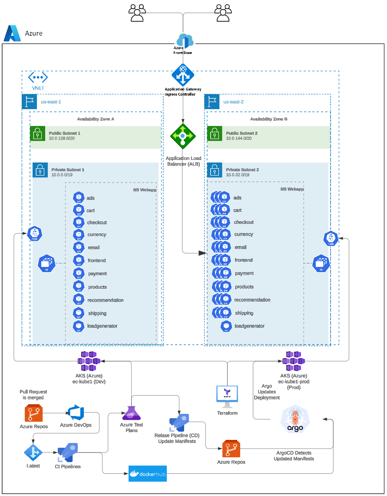

### Key Components

#### A. **Source Code Management**

- **GitHub**:
  - Serves as the backbone of version control, ensuring seamless collaboration among team members.
  - Pull requests and branch strategies help enforce coding standards and encourage peer reviews.
  - Integrated with Jenkins to trigger automated builds and tests upon code commits, ensuring continuous integration.
  - Setup with the Azure Devops Project with connection to the git repository

#### B. **Build and Test Automation**

**Azure DevOps**:
  - Orchestrates the CI/CD pipeline, ensuring that builds, tests, and deployments are fully automated.
  - Integrates with tools like GitHub and Docker to create a streamlined process from code commit to deployment.
  - Provides real-time feedback to developers about build status and test results.
  - After successful build the pipeline will update the deployment-services.yaml

  **Azure Pipelines**
  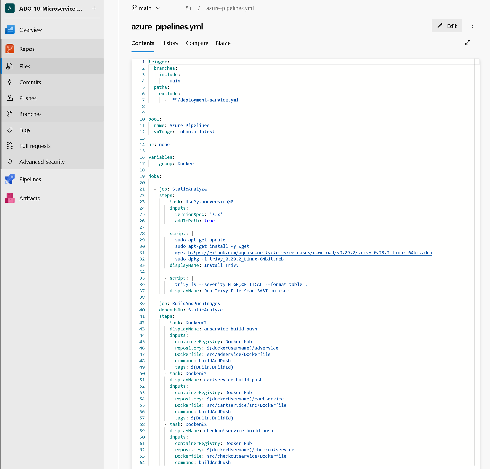
  
  **CI Pipelines**
  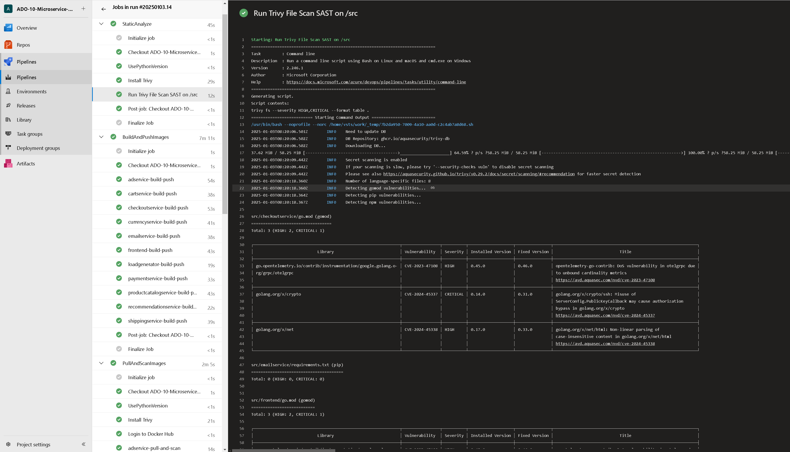

  **Updates to YAML from Pipelines**
  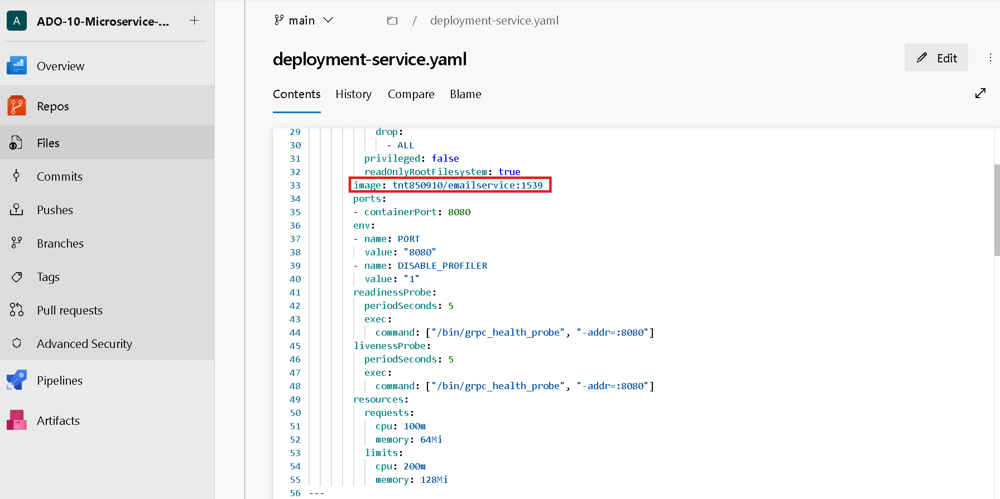

  **Release Pipelines**
  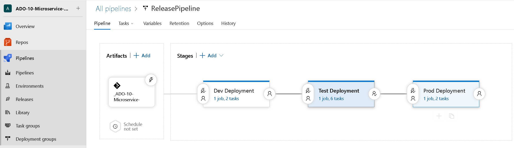

  **Dev AKS Deployment**
  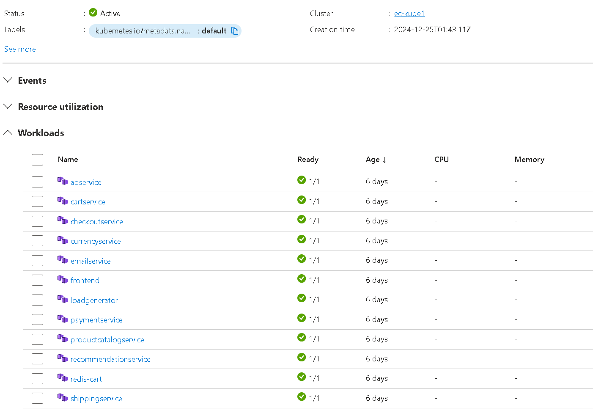

  **Prod AKS Deployment**
  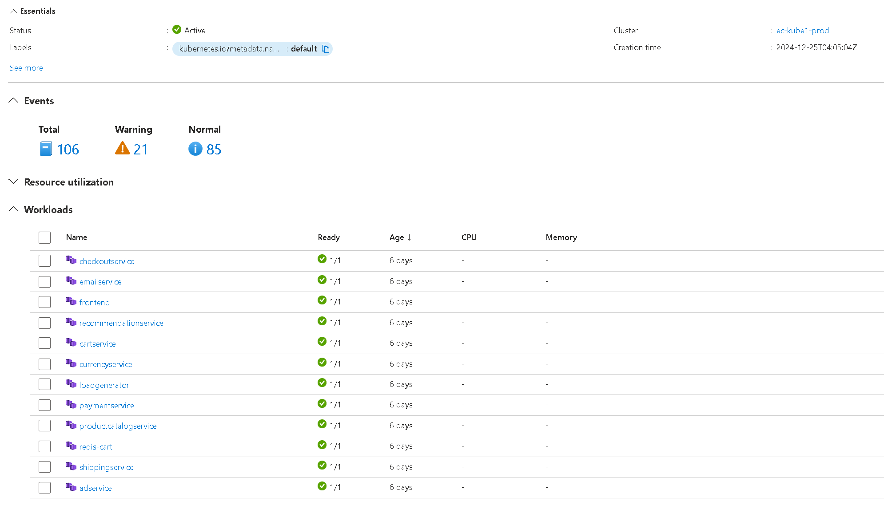

> **Azure DevOps - TODO**:
    - **Regional vCPU**
      - Constraints in allocations requried me to keep requesting additional resources.
      - This is cost prohibitive, so 1 pod for each service is left
    - **Update to Terraform Apply**
      - Currently elies on external Terraform setup for environment to work
      - When cluster is built API changes
      - Permissions for Jenkins need to be created with cluster (kubectl)
    - **Separate GitOps Repo**
      - Move deployment code to its own repo instead of a branch of this repo

#### C. **Security Scanning**

- **Aqua Trivy**:
  - Scans Docker docs/img and source code for vulnerabilities, ensuring that potential security issues are caught before deployment.
  - Generates detailed reports that can be used to address vulnerabilities promptly.

  **Trivy File Scan of /src/**

  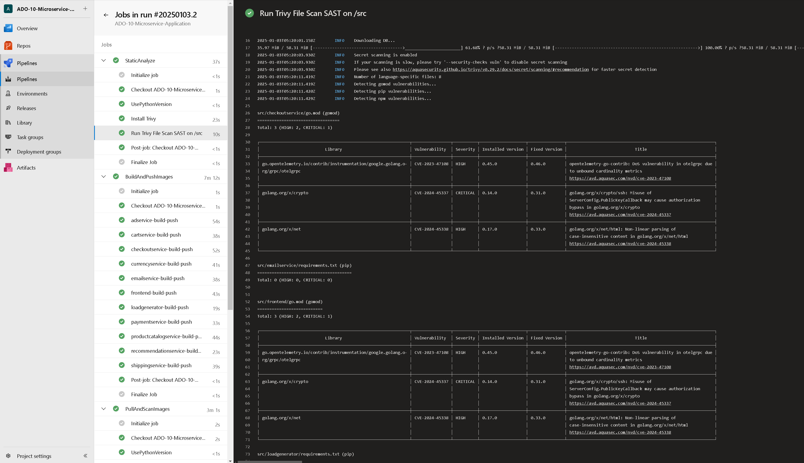

  **Trivy Image Scan results**

  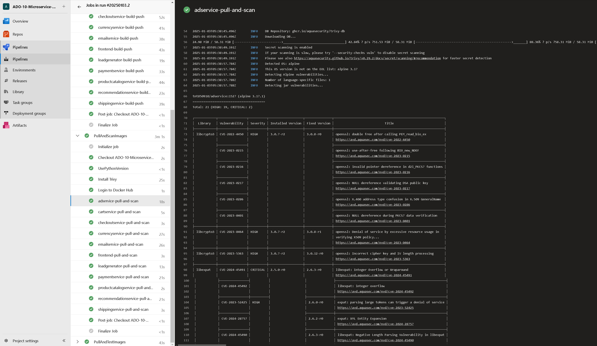

#### D. **Containerization**

- **Docker**:
  - Packages the Java application into lightweight, portable containers, ensuring consistent environments across development, testing, and production stages.
  - Simplifies deployment by abstracting underlying infrastructure differences.

#### E. **Container Orchestration**

- **Azure Kubernetes Service (AKS)**:
  - Manages the deployment and scaling of containerized applications in a highly available environment.
  - Ensures zero downtime by automatically scaling and redistributing workloads as needed.
  - Namespace configurations (e.g., `webapps`) isolate different parts of the system for better organization and security.

<!-- REMOVE WHEN ARGO IS WORKING
#### F. **GtiOps with ArgoCD**

- **Argo Dashboard**
  

- **Argo Sync**
  

- **Argo Updates**
  

- **Argo Rollback**
  
-->

<!-- REMOVE WHEN Monitoring IS WORKING
#### F. **Monitoring and Observability**

- **Prometheus**:
  - Collects metrics from various components of the application and infrastructure, providing deep insights into system health and performance.
  - Supports custom queries to detect anomalies and trigger alerts proactively.
  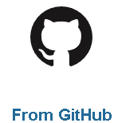

- **Grafana**:
  - Provides user-friendly dashboards for visualizing Prometheus metrics.
  - Enables stakeholders to monitor key performance indicators (KPIs) in real-time, ensuring system reliability.
  

  *Callout Area*: Include snapshots of Grafana dashboards and Prometheus query outputs, demonstrating the observability aspect of the pipeline.
-->

<!-- Removed Until IaC is added to the project
#### G. **Infrastructure as Code (IaC)**

- **Terraform**:
  - Automates the provisioning and management of infrastructure required for the Kubernetes stack that hosts the Java application.
  - Ensures infrastructure consistency and repeatability by defining it as code.
  - The following key AWS resources are provisioned:
    - **VPC**: Creates a virtual private cloud for network isolation.
    - **Subnets**: Two public subnets in `us-east-1a` and `us-east-1b` availability zones.
    - **Internet Gateway**: Provides internet access to the resources within the VPC.
    - **Route Tables and Associations**: Configures routing for the subnets to allow public internet access.
    - **Security Groups**: Defines rules for cluster and node communication, ensuring controlled ingress and egress.
    - **AKS Cluster**: Deploys an Azure Kubernetes Service cluster for managing the application containers.
    - **AKS Node Group**: Provisions a scalable worker node group with `t2.large` instances to support container workloads.
    - **IAM Roles and Policies**: Configures roles and permissions for both the AKS cluster and node group to interact with AWS services.
  - Facilitates rapid updates and scaling of infrastructure to match application requirements.

``` bash
terraform plan
```

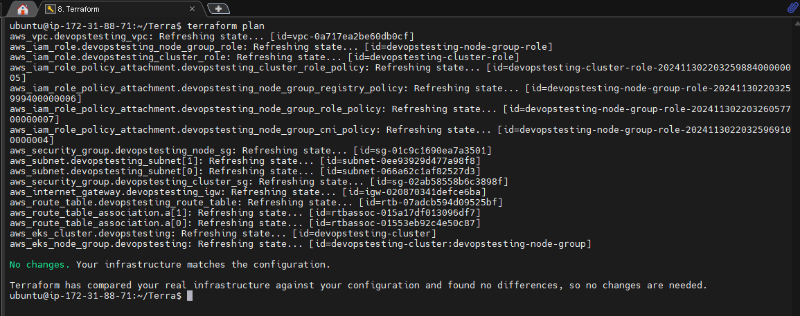

``` bash
terraform apply --auto-approve
```

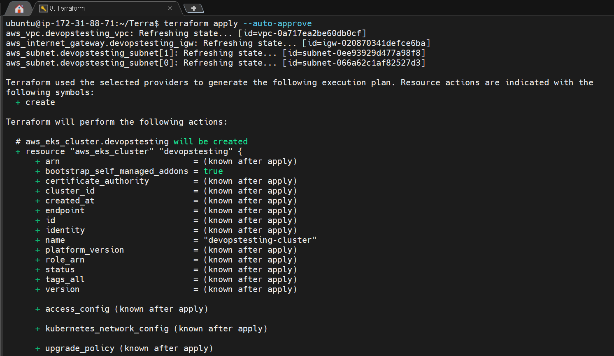
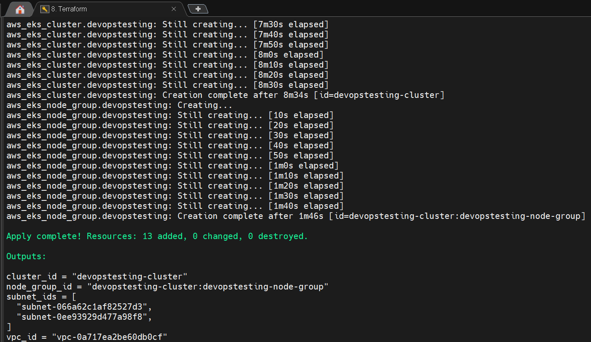 
-->