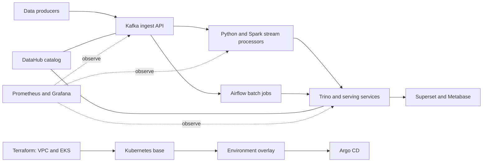

# AWS Streaming Platform Scaffold

A repository generator and reference layout for a containerized streaming-data
platform on AWS. It organizes Terraform, Kubernetes overlays, Argo CD,
Airflow, stream processors, query services, catalog services, and dashboards
as one environment-aware deployment.

The checked-in files are a scaffold: values such as `{{ KAFKA_BROKER }}` and
`{{ S3_BUCKET }}` must be replaced for a real environment before the manifests
or services can run.

Use it when you want a concrete starting boundary between infrastructure,
GitOps, batch processing, stream processing, serving, catalog, visualization,
and observability instead of beginning with an empty repository.

## What the scaffold provides

| Area | Included starting point |
| --- | --- |
| AWS infrastructure | Terraform for a VPC, EKS node group, and application load balancer |
| GitOps | Argo CD application and environment-specific Kustomize overlays |
| Ingestion | FastAPI endpoint that publishes JSON events to Kafka |
| Processing | Python consumer, Spark batch job, and Spark streaming job |
| Serving and catalog | Trino, DataHub, Pinot/Elastic connector example |
| Operations | Airflow DAG, Prometheus, Grafana, Superset, and Metabase resources |

## Architecture


```mermaid
flowchart LR
    A[Data producers] --> B[Kafka ingest API]
    B --> C[Python and Spark stream processors]
    B --> D[Airflow batch jobs]
    C --> E[Trino and serving services]
    D --> E
    E --> F[Superset and Metabase]
    G[DataHub catalog] --- B
    G --- E
    H[Prometheus and Grafana] -. observe .-> B
    H -. observe .-> C
    H -. observe .-> E

    I[Terraform: VPC and EKS] --> J[Kubernetes base]
    J --> K[Environment overlay]
    K --> L[Argo CD]
```

## Repository layout

```text
create_project.sh               # regenerate the scaffold
infra/
├── terraform/                  # VPC, subnets, EKS, and node group
├── k8s/
│   ├── base/                   # shared workloads and platform resources
│   └── overlays/               # dev, QA, staging, and production values
├── argo-cd/                    # reconciliation entry point
└── airflow/                    # batch orchestration
services/
├── kafka_ingest/               # FastAPI-to-Kafka ingestion
├── python_stream_processor/    # Kafka consumer example
├── spark_batch_processor/      # S3 batch processing
├── realtime_processor/         # Spark structured streaming
├── ksqdb_connector/            # Pinot/Elastic connector example
├── serving_trino/              # query service configuration
├── visualization_superset/     # Superset container
├── visualization_metabase/     # Metabase container
└── data_catalog/               # DataHub configuration
```

## Generate a fresh scaffold

`create_project.sh` writes the full directory tree into the current directory.
Run it in an empty working directory so it does not overwrite local changes:

```bash
mkdir streaming-platform
cp create_project.sh streaming-platform/
cd streaming-platform
bash create_project.sh
```

The generated services are intentionally small. They establish container and
configuration boundaries that can be replaced with production implementations
without changing the surrounding directory contract.

See [Adapting the scaffold](docs/adapting-the-scaffold.md) for the placeholder
inventory, replacement order, and local validation boundary.

## Configure an environment

1. Choose an overlay under `infra/k8s/overlays/`.
2. Replace every `{{ ... }}` template value with environment-specific input.
3. Pin container image versions instead of using floating tags.
4. Configure AWS credentials through the standard AWS credential chain.
5. Store application secrets in a secret manager, not in the generated files.
6. Review the Terraform plan before creating paid cloud resources.

Find unresolved template values with:

```bash
rg -n '\{\{' infra services
```

When that command returns no matches, validate the infrastructure and selected
Kubernetes overlay:

```bash
terraform -chdir=infra/terraform fmt -check
terraform -chdir=infra/terraform init -backend=false
terraform -chdir=infra/terraform validate

kubectl kustomize infra/k8s/overlays/dev >/tmp/streaming-platform-dev.yaml
kubectl apply --dry-run=client -f /tmp/streaming-platform-dev.yaml
```

Run `bash -n create_project.sh` before regenerating the tree. Terraform
initialization downloads providers and modules; the Kubernetes checks require
all template values to be replaced first.

## Deployment order

The intended order is:

1. Provision the VPC and EKS cluster with Terraform.
2. Install cluster prerequisites and create runtime secrets.
3. Build and publish the service images.
4. Render and review the chosen Kustomize overlay.
5. Register [`infra/argo-cd/application.yaml`](infra/argo-cd/application.yaml)
   with Argo CD.
6. Wait for workloads to become ready.
7. Send a synthetic event through Kafka and confirm the processed result at the
   serving layer.
8. Review Prometheus/Grafana telemetry and tear the environment down when the
   experiment is complete.

Cloud provisioning is intentionally manual because it creates billable AWS
resources. The helper scripts under `infra/terraform/` provide deployment and
teardown entry points after configuration has been reviewed.

The pinned examples reflect the repository's original implementation period.
Review current AWS, Kubernetes, Terraform module, container image, and dependency
versions before creating a new environment.

## License

This project is available under the [MIT License](LICENSE). Images and software
used by the generated containers remain under their respective licenses.
