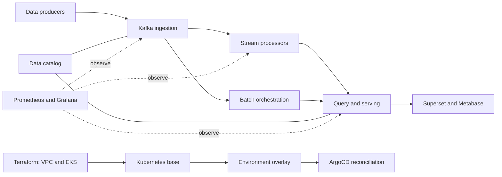

# A Repeatable Streaming-Platform Deployment on AWS

This repository is a reference implementation for deploying the shape of a
real-time data platform: AWS infrastructure, Kubernetes environment overlays,
GitOps reconciliation, independently packaged services, orchestration, and
observability.

Its purpose is to make a complex platform inspectable and repeatable—not to
claim production scale that has not been benchmarked.

## The so-what

Data-platform diagrams are easy to draw and difficult to turn into a coherent
deployment. This project asks a more useful question:

**Can infrastructure, stream processors, query services, orchestration, and
observability be represented as one environment-aware delivery system?**

The repository demonstrates:

- an AWS VPC and EKS foundation expressed in Terraform;
- Kubernetes bases plus development, QA, staging, and production overlays;
- an ArgoCD application as the reconciliation entry point;
- separate containers for ingestion, stream processing, batch processing,
  catalog, query, and visualization responsibilities;
- an Airflow DAG for orchestration;
- Prometheus and Grafana deployment stubs for operating visibility.

## Architecture


```mermaid
flowchart LR
    A[Data producers] --> B[Kafka ingestion]
    B --> C[Stream processors]
    B --> D[Batch orchestration]
    C --> E[Query and serving]
    D --> E
    E --> F[Superset and Metabase]
    G[Data catalog] --- B
    G --- E
    H[Prometheus and Grafana] -. observe .-> B
    H -. observe .-> C
    H -. observe .-> E

    I[Terraform: VPC and EKS] --> J[Kubernetes base]
    J --> K[Environment overlay]
    K --> L[ArgoCD reconciliation]
```

## Repository map

| Path | Responsibility | Evidence level |
| --- | --- | --- |
| [`infra/terraform`](infra/terraform) | VPC, subnets, EKS, node group, load balancer | Implemented configuration; requires environment validation |
| [`infra/k8s/base`](infra/k8s/base) | Shared Kubernetes workloads and observability resources | Implemented manifests |
| [`infra/k8s/overlays`](infra/k8s/overlays) | Dev, QA, stage, and prod customization | Implemented environment structure |
| [`infra/argo-cd`](infra/argo-cd) | GitOps reconciliation entry point | Implemented application definition |
| [`infra/airflow`](infra/airflow) | Batch and dependency orchestration | Prototype DAG |
| [`services`](services) | Independently packaged platform responsibilities | Prototype services and configuration |

## Repeatable deployment path

The intended validation sequence is:

1. Format and validate the Terraform configuration.
2. Review an environment-specific Terraform plan before provisioning AWS.
3. Render the selected Kustomize overlay and reject invalid manifests.
4. Build each service container from a pinned dependency set.
5. Reconcile the environment through ArgoCD.
6. Verify workload readiness, service discovery, and a synthetic event path.
7. Capture metrics, failure criteria, cost, and teardown results.

Current structural checks:

```bash
terraform -chdir=infra/terraform fmt -check
rg -n '\{\{' infra services
```

The second command intentionally reports unresolved template values. The
checked-in Kustomize files are scaffolds, not directly renderable deployment
artifacts. Before provisioning, an environment-specific materialization step
must replace every reported value; only then should `terraform validate`,
`kubectl kustomize`, and a server-side dry run be treated as gates.

Cloud provisioning is intentionally not part of an automatic hosted workflow;
it requires explicit credentials, cost awareness, and a planned teardown.

## Evidence and limits

This repository currently proves the configuration structure and service
boundaries. It does **not** yet provide a ready-to-apply environment because
template materialization is incomplete. It also does not prove a specific
throughput, latency, uptime, cost saving, deployment frequency, or
petabyte-scale result. Those claims require a retained benchmark tied to an
exact commit, workload, AWS topology, time window, raw output, and cost report.

The next high-value milestone is a bounded end-to-end experiment:

- deploy one environment;
- publish a synthetic event stream at a recorded rate;
- verify one processed result through the serving layer;
- retain latency and error measurements;
- demonstrate teardown and report the actual cost.

That packet would convert this from a deployment reference into measured
operating evidence.
