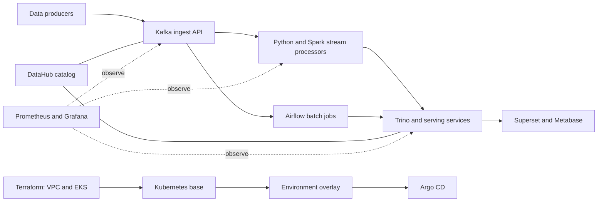

<div align="center">

# AWS Streaming Platform Scaffold

**One script lays out an entire streaming-data platform: ingest, process, serve, catalog, visualize, observe.**

A repository generator and reference layout for a containerized streaming
platform on AWS. Terraform, Kustomize overlays, Argo CD, Airflow, Kafka-facing
services, Spark jobs, Trino serving, catalog and dashboards each get
their own clear slot, so you start from a structure instead of an empty repo.

[](https://github.com/T-Py-T/bigdata-aiops-aws/actions/workflows/pr-checks.yml)

[Getting started](#getting-started) ·
[Demo](#demo-from-template-to-rendered-manifests) ·
[What you get](#what-the-scaffold-provides) ·
[Configure](#configure-an-environment) ·
[Contributing](#contributing)

</div>

> [!NOTE]
> **This is a scaffold, not a running platform.** Values such as
> `{{ KAFKA_BROKER }}`, `{{ S3_BUCKET }}` and `{{ KAFKA_INGEST_IMAGE }}` must be
> replaced before anything can run. Nothing in this repository is deployed to
> AWS. There are no screenshots, because there is no live environment to
> capture; the architecture diagram below is the visual.

## Architecture


```mermaid
flowchart LR
    A[Data producers] --> B[Kafka ingest API]
    B --> C[Python and Spark stream processors]
    B --> D[Airflow batch jobs]
    C --> E[Trino and serving services]
    D --> E
    E --> F[Superset and Metabase]
    G[DataHub catalog] --- B
    G --- E
    H[Prometheus and Grafana] -. observe .-> B
    H -. observe .-> C
    H -. observe .-> E

    I[Terraform: VPC and EKS] --> J[Kubernetes base]
    J --> K[Environment overlay]
    K --> L[Argo CD]
```

## What the scaffold provides

| Area | Starting point |
| --- | --- |
| AWS infrastructure | Terraform for a VPC, an EKS managed node group and an application load balancer, with pinned provider and module versions |
| GitOps | Argo CD `Application` plus Kustomize overlays for dev, QA, staging and production |
| Ingestion | FastAPI endpoint that publishes JSON events to Kafka |
| Processing | Python Kafka consumer, Spark batch job and Spark structured-streaming job |
| Serving and catalog | Trino config, DataHub catalog, Pinot/Elastic connector example |
| Operations | Airflow DAG, Prometheus, Grafana, Superset and Metabase resources |

Every Dockerfile's parent image is pinned by digest, Python requirements are
pinned, and the repository tests check that the generator still reproduces the
checked-in service files.

## Getting started

### Prerequisites

- Bash and Python 3
- Optional: Terraform 1.5.7+ (CI uses 1.16.2), `kubectl`, and
  [`ripgrep`](https://github.com/BurntSushi/ripgrep)
- AWS credentials only if you plan a real apply. The offline steps below
  don't need them.

### Clone and check

```bash
git clone https://github.com/T-Py-T/bigdata-aiops-aws.git
cd bigdata-aiops-aws

bash -n create_project.sh infra/terraform/deploy.sh infra/terraform/destroy.sh
python3 -m unittest discover -s tests -v
```

The four scaffold tests check that the generator output matches the checked-in
files, parent images are digest-pinned, every Python source parses, and
workflows only run on pull requests.

## Generate a fresh scaffold

`create_project.sh` writes the tree into the current directory, so run it in
an empty one:

```bash
mkdir streaming-platform
cp create_project.sh streaming-platform/
cd streaming-platform
bash create_project.sh
# Project scaffold created successfully.
```

The generator writes 36 files: every service under `services/`, the
Kubernetes base, the **dev** overlay, the Argo CD application and the Airflow
DAG. The Terraform under `infra/terraform/` and the QA, staging and production
overlays live only in this repository's checked-in tree, so copy them across
if you want them.

## Demo: from template to rendered manifests

This walk-through runs offline and creates no cloud resources.

**1. Generate** a fresh tree, as above.

**2. Fill the placeholders with throwaway example values.** This replaces
every image placeholder with `registry.example.com/<name>` and every other
placeholder with an `example-…` string:

```bash
rg -l '\{\{' infra services | xargs perl -pi -e '
  s/\{\{ *([A-Z0-9_]+)_IMAGE *\}\}/"registry.example.com\/".lc($1)/ge;
  s/\{\{ *([A-Z0-9_]+) *\}\}/"example-".lc($1)/ge'
rg -n '\{\{' infra services || echo "no placeholders left"
```

**3. Render the dev overlay.**

```bash
kubectl kustomize infra/k8s/overlays/dev > dev.yaml
grep '^kind:' dev.yaml | sort | uniq -c
#   10 kind: Deployment
#    1 kind: Prometheus
#    1 kind: Service
```

Kustomize warns that `bases` and `patchesStrategicMerge` are deprecated, but
it still renders. Image names come out as, for example,
`registry.example.com/kafka_ingest:dev`.

**4. Optionally, schema-check the result.**

```bash
go run github.com/yannh/kubeconform/cmd/kubeconform@v0.8.0 \
  -strict -ignore-missing-schemas -summary dev.yaml
# Summary: 12 resources found in 1 file - Valid: 11, Invalid: 0, Errors: 0, Skipped: 1
```

The skipped resource is the `Prometheus` custom resource, which needs the
Prometheus Operator CRDs.

**5. Poke the ingest API.** The health route doesn't need Kafka:

```bash
cd services/kafka_ingest
python3 -m venv .venv && . .venv/bin/activate
pip install -r requirements.txt
cd src && uvicorn ingest:app --port 8000 &
curl -s http://127.0.0.1:8000/health
# {"status":"ok"}
```

`POST /ingest` publishes to Kafka, so it needs a real `KAFKA_BROKER`.

## Configure an environment

1. Choose an overlay under `infra/k8s/overlays/`.
2. Replace every `{{ ... }}` value with environment-specific input. The full
   placeholder inventory is in
   [Adapting the scaffold](docs/adapting-the-scaffold.md).
3. Pin container images to versions or digests instead of floating tags.
4. Configure AWS credentials through the standard AWS credential chain.
5. Keep application secrets in a secret manager. For example, Superset reads
   `superset-secret-key` from a `bigdata-platform-secrets` Kubernetes Secret
   that you create.
6. Review the Terraform plan before creating paid resources.

Validate the infrastructure offline:

```bash
terraform -chdir=infra/terraform fmt -check
terraform -chdir=infra/terraform init -backend=false
terraform -chdir=infra/terraform validate
```

`init` downloads the AWS provider and the VPC/EKS modules but creates nothing.
On a clean checkout all three pass.

Most Terraform variables (region, VPC name and CIDR, subnets, cluster name,
environment, project) have no default. You supply them, for example in a
`.tfvars` file, before `plan`.

## Deploying to AWS

None of this was run for this README. It creates billable AWS resources.

1. Provision the VPC and EKS cluster with Terraform.
2. Install cluster prerequisites and create runtime secrets.
3. Build, scan and publish the service images.
4. Render and review the chosen overlay.
5. Register [`infra/argo-cd/application.yaml`](infra/argo-cd/application.yaml)
   with Argo CD. It syncs the dev overlay with automated prune and self-heal.
6. Wait for the workloads, send a synthetic event through Kafka, and confirm
   the result at the serving layer.
7. Review Prometheus and Grafana, then tear the environment down.

> [!WARNING]
> `infra/terraform/deploy.sh deploy` runs `terraform plan` and then
> `terraform apply -auto-approve` with no pause. `destroy` runs
> `terraform destroy -auto-approve`. Read the plan yourself first, or run the
> Terraform commands by hand.

## Repository layout

```text
create_project.sh               # regenerate the scaffold
infra/
├── terraform/                  # VPC, subnets, EKS node group, ALB
├── k8s/
│   ├── base/                   # shared workloads and platform resources
│   └── overlays/               # dev, QA, staging, and production values
├── argo-cd/                    # reconciliation entry point
└── airflow/                    # batch orchestration
services/
├── kafka_ingest/               # FastAPI-to-Kafka ingestion
├── python_stream_processor/    # Kafka consumer example
├── spark_batch_processor/      # S3 batch processing
├── realtime_processor/         # Spark structured streaming
├── ksqdb_connector/            # Pinot/Elastic connector example
├── serving_trino/              # query service configuration
├── visualization_superset/     # Superset container
├── visualization_metabase/     # Metabase container
└── data_catalog/               # DataHub configuration
tests/                          # scaffold consistency tests
```

The services are intentionally small. They mark container and configuration
boundaries that you can swap for real implementations without changing the
surrounding layout.

## Contributing

Ideas welcome: replace a stub service with a real one, add an overlay, modernize
the Kustomize syntax, or add another offline check.

1. Fork the repository and branch from `main`.
2. If you change a generated file, change `create_project.sh` to match. The
   scaffold tests compare the two.
3. Run `bash -n create_project.sh`, `python3 -m unittest discover -s tests -v`,
   and `terraform -chdir=infra/terraform fmt -check` (or
   `pre-commit run --all-files`, which runs all three).
4. Don't commit credentials, AWS account identifiers or private endpoints.
   Keep placeholders and synthetic data in examples.
5. Open a pull request against `main`.

See [CONTRIBUTING.md](CONTRIBUTING.md). Please report vulnerabilities
privately as described in [SECURITY.md](SECURITY.md).

## License

This project is available under the [MIT License](LICENSE). Images and
software used by the generated containers remain under their own licenses.
